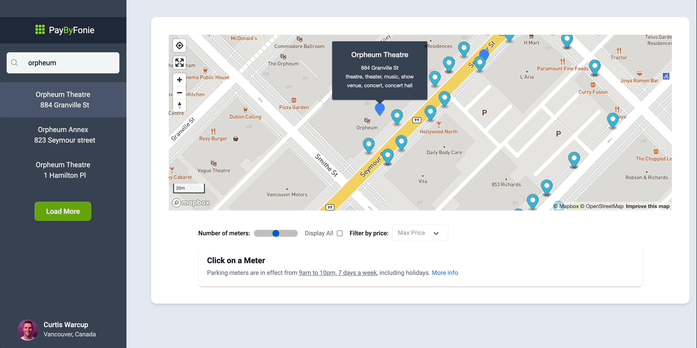

## PayByFonie

I hate parking, especially in downtown Vancouver. 

Plan ahead and use PayByFonie to pay for parking in Vancouver. You can save thousands of dollars a year by using this app! 

Check out the app here: https://paybyfonie.vercel.app/
## How to use

Enter a location in the search bar

Filter by average parking price

Increase the number of results

Compare and find the best prices

Load more search results

## Tools

- [React-map-gl ](https://visgl.github.io/react-map-gl/)
- [Mapbox](https://docs.mapbox.com/mapbox-gl-js/guides/)
- [React](https://reactjs.org/)
- [Vancouver Open Data](https://opendata.vancouver.ca/explore/?disjunctive.features&disjunctive.theme&disjunctive.keyword&disjunctive.data-owner&disjunctive.data-team&sort=modified)
- [React Icons](https://react-icons.github.io/react-icons/)
- [Tailwind CSS](https://tailwindcss.com/)

