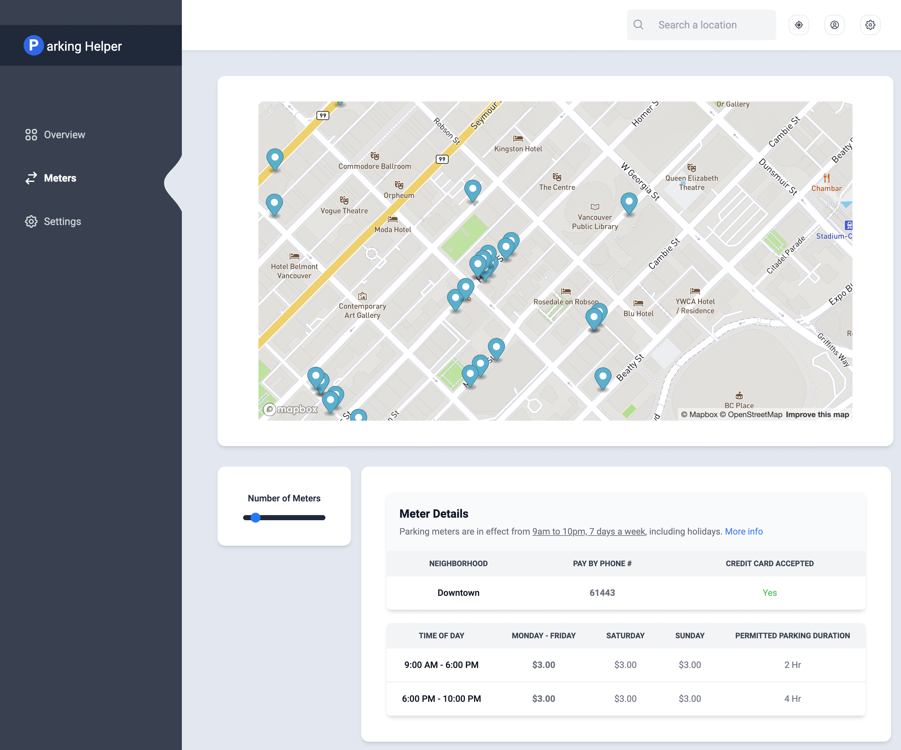

## Parking Buddy

I hate parking, especially in downtown Vancouver. 

This tool is a simple way to find parking in downtown Vancouver. It uses the City of Vancouver's open data to determine parking meter rates, duration, and Pay By Phone zones.

## Tools

- [React-map-gl ](https://visgl.github.io/react-map-gl/)
- [Mapbox](https://docs.mapbox.com/mapbox-gl-js/guides/)

Check out the app here: https://van-meter-parking.vercel.app/

